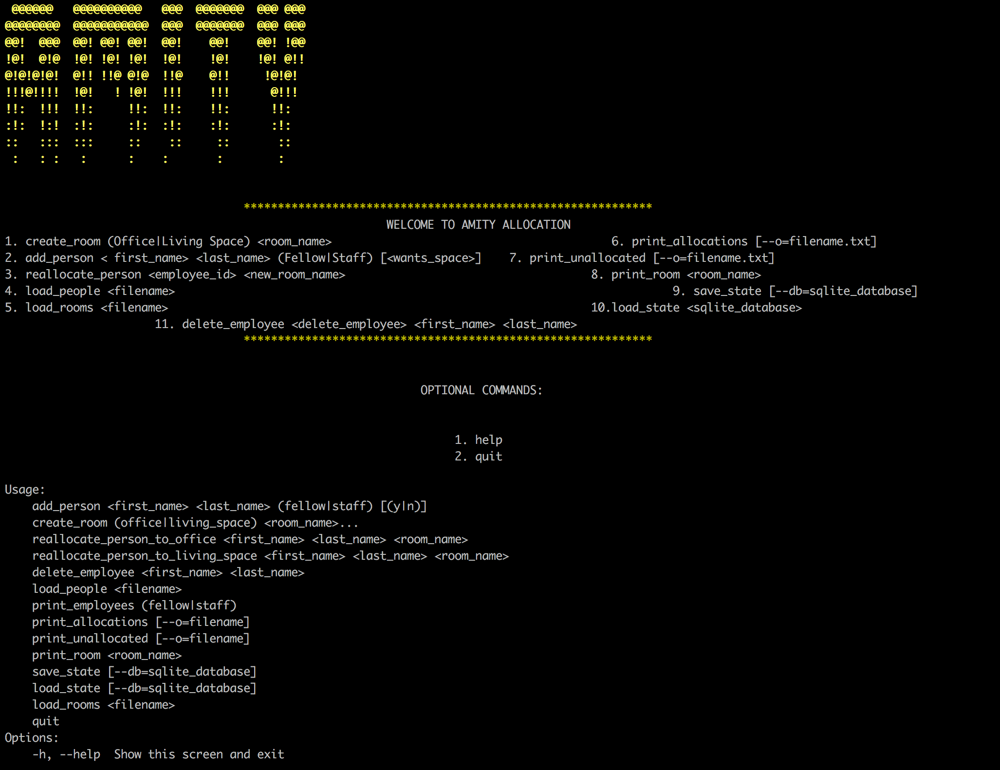

# check point 1 Amity room allocations

# Description
This is a python console applicaton that allocates offices and living spaces to staff and fellows.

    

# Requirements
Python 3.6

# Installation

1) Clone the repo from GitHub:

git clone https://github.com/nzaujk/cp1-amity-room_allocation_nzau.git

2) In your terminal, navigate to the root folder:
cd cp1

3) Install the necessary packages with:
$ pip install -r requirements.txt

# Launching the program
$ python app.py

# Running the tests

$ nosetests

